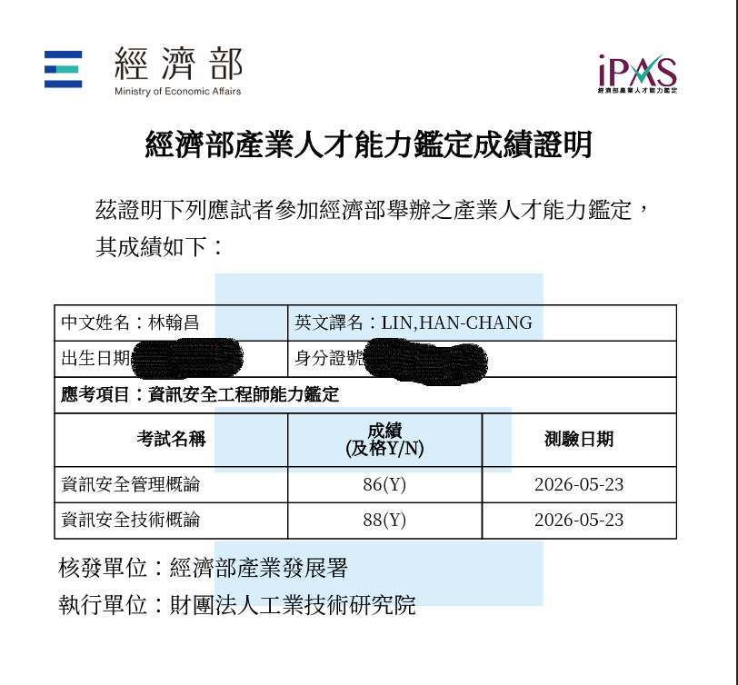

# iPAS 資訊安全工程師 準備指南 初級篇
版本：v2.0（依老師實際報考並通過 115 年初級測驗經驗，重整準備流程與學習資源）

本文件供竹山高中資料處理科學生有志考取 iPAS 資訊安全工程師證照者參考

## 官方網站
報名、考試、領證資訊：
[官方網站](https://ipd.nat.gov.tw/ipas/certification/ISE/news)

## 為什麼要考 iPAS，而非其他資安證照？
1. 便宜  
   初級 2 科 1600 元、中級 2 科 2000 元（先考初級再報中級有優惠，2 科變 1400 元），其他夠份量的資安證照動輒上萬。（資安證照沒幾千塊的） 
    - 可至「數位發展部資通安全署」網站查閱核可的資通安全專業證照清單  
    <https://moda.gov.tw/ACS/laws/certificates/676>
2. 中文，其他核可資安專業證照幾乎都是英文考試
3. 可作為部分大學校系**特殊選才資安外加名額**申請資格
    
## 學習資源整理

- [官方學習資源頁面](https://ipd.nat.gov.tw/ipas/certification/ISE/learning-resources)  
包括初級兩個科目的學習指引、最新一屆考古題、參考書目，和工研院課程網站的雲端課程。  
雲端課程**免費**，連往工研院課程網站，要先註冊才能上課，但  
**註冊完至少等一、兩天，帳號才會開通，開通後才能上課**

- [林志祥 / iPAS資安證照討論區 Q&A - HackMD](https://hackmd.io/@hiiii/ryOzgaf0a)  
由資安證照分享達人林志祥整理，**內容極度詳盡**的討論區。
綜整歷屆考古題、比官方更多的工研院免費課程連結、作者自製重點講述與歷屆試題檢討影片和相關 Q&A

## 初級準備歷程
老師有報考 115 年 5 月的初級測驗，成績如下，講這些準備歷程應該還有點說服力。
  

### 考前三個月
1. 報名並繳費
    證照考試沒報名繳費前，再怎麼吹噓多想考到都是假的。花了錢都未必會用心準備，不花錢絕對不會準備。  
    **沒去報名繳費完成，別說你想考證照。**
2. 到官方學習資源頁面，下載「資訊安全管理概論」、「資訊安全技術概論」學習指引，好好研讀。這是一切的基礎。
    <https://ipd.nat.gov.tw/ipas/certification/ISE/learning-resources>
3. 到數位發展部資通安全署資安人才培訓服務網 -> 資料下載，下載「《資通安全概論》新版教材」，好好研讀。雖然這是給公務機關訓練資安人才的教材，和 iPAS 考試沒有直接關係，但內容相近，特別是「管理概論」內容，比官方學習指引還詳盡。
    <https://ctts.nics.nat.gov.tw/Download>
4. 以上三本，最好在一～一個半月內完成。

### 考前兩個月
1. 那三本書還沒研讀完的話，繼續讀完。然後可以開始看影片。
2. 官方學習資源頁面有提供工研院課程網站的雲端課程連結。  
    雲端課程**免費**，連往工研院課程網站，要先註冊才能上課，但  
    **註冊完至少等一、兩天，帳號才會開通，開通後才能上課**  

    註冊後發現課程很多，老師建議看以下 3 個就好：

3. [資安維運與新興科技安全](https://collegeplus.itri.org.tw/course/2240#/)  
    - 初級課程重點整理，比〈資訊安全技術概論〉詳盡一些  
    - 北科大資財系魏銪志老師主講
4. [資訊安全管理概論](https://collegeplus.itri.org.tw/course/1151#/)  
　  - 初級課程重點整理與 109 年第二次試題詳解  
　  - 北科大資財系魏銪志老師主講  
5. [資訊安全技術概論](https://collegeplus.itri.org.tw/course/1150#/)  
　  - 初級課程重點整理與 109 年第二次試題詳解  
　  - 北科大資財系魏銪志老師主講  
6. 看人家解題主要是學習解題方法，看魏老師解過一次，接下來就要自己解了。

### 考前 6 週
1. 到這裡，理論上三本書都要讀完，影片也看完了。還沒做到的人，趕快補完進度，才進行以下步驟。
2. [iPAS 資訊安全工程師 觀念筆記](https://hackmd.io/@hiiii/BJYND6jE-g)  
    由資安考照分享達人林志祥編纂，解題前先把考科內容重點好好複習一次。
3. 至於林志祥的自錄複習影片，老師就沒看了，同學可以斟酌取用。

### 考前 4 週
1. 開始寫考古題，老師是一天寫一屆兩科，而且寫完立刻寫錯題檢討。嫌份量太重無法兼顧課業的話，可以減量為一天一科，錯題檢討後補。但最好 3 ~ 4 天就解決掉一屆。所以你最好視個人學習情況，提早到考前 6 週就順便開始。但還是**先把觀念筆記讀完**，否則連基本題都還會錯，考古題練習起來就會非常吃力。
2. [初級歷屆考古題連結](https://drive.google.com/drive/folders/1cDoDnJhGu4uo4sSovNGDyM2J2uIxHRCX)  
    老師是從舊寫到新，因為有些舊觀念後來被翻盤，所以**觀念有衝突的話以越新的題目解答為準**。
3. 寫考古題一定要寫**錯題檢討**。老師對自己比較嚴格，四個選項只要一個不確定就當錯題來處置。寫錯題檢討的目的是要**彌補學習的不足**，以後不會再錯第二次。可以參考老師的格式：  
    <https://github.com/cs20101-cshs/dp/tree/main/write_up/ipas>

### 考前 1 週
1. 到這時候，歷屆考古題應該都要寫過一遍，也做完錯題檢討了。
2. 所以除了複習林志祥的**觀念筆記**，基本上就看你自己的**錯題檢討**。
3. 保持良好作息，準備應考。
4. 祝大家都能一次考取，不用反覆煎熬。
