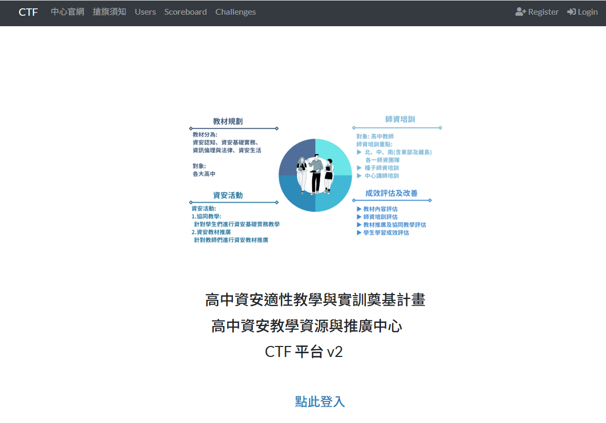
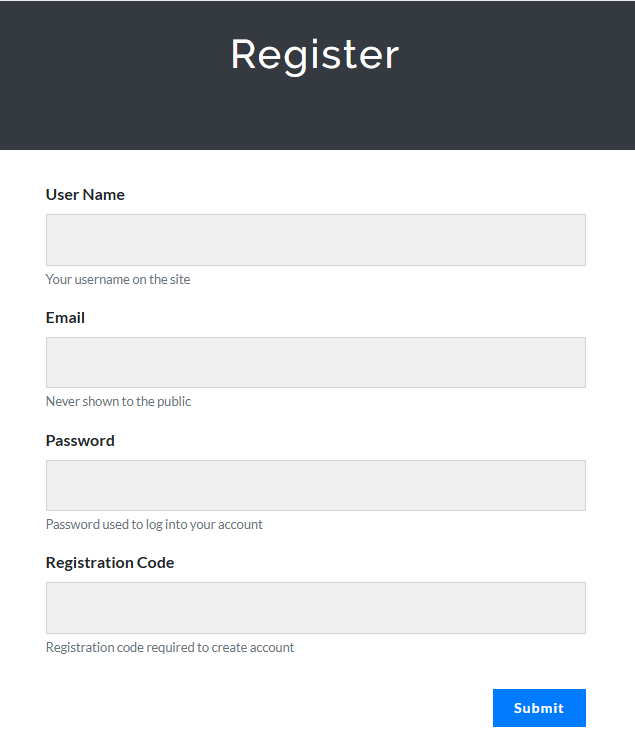
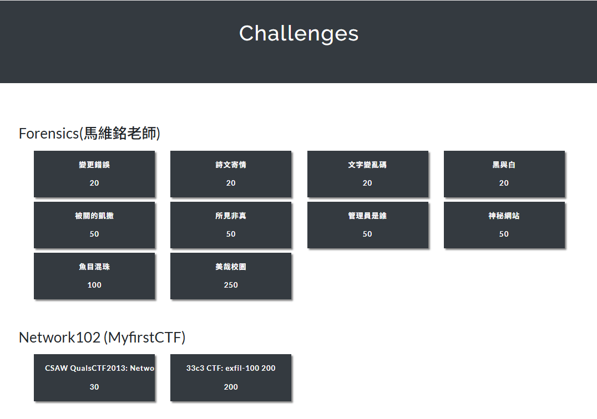

# ISIP CTF 平台使用說明
版本：v1.0  

本文件係協助竹山高中資料處理科學生註冊「高中資安教學資源與推廣中心」（ISIP）的 CTF 平台與後續練習說明使用。

## 注意事項
1. 本站僅供合法 CTF 練習使用。
2. 只能操作站內題目與指定靶機。
3. **不要嘗試攻擊非題目指定網站。**
4. 解題紀錄可以寫過程，但**不要公開 flag**。
5. 若題目連結失效或附件不存在，先暫時跳過。

## 註冊與登入
1. 站台網址：
    <https://ctf.isip-hs.org/>

2. 點選右上方的 `Register`。

3. 進入註冊畫面：
    - `User Name` 統一使用 `CSHS` 連接學號 6 碼，例如學號為 000000，則輸入 `CSHS000000`。
    - `Email` 使用你學校的 Gmail 信箱。
    - `Password` 自己打。千萬別忘記，這站台不是老師養的，沒辦法救你。
    - `Registration Code` 老師會提供在 **資安訓練 LINE 群組**，請勿外流。

>[!WARNING]
> - `Registration Code` 只供本校參與特訓的學生使用，請勿轉傳，也不要貼到公開網路上。

4. 按右下角 `Submit` 鍵送出，即註冊完成。

## 畫面介紹
1. 登入後即進入 `Challenges` 頁面，裡頭就是一道道 CTF 題目，點進去即可解題。

2. 成功解決的題目，方框顏色會變淺，表示已經破關。已破關的題目不能重複破關練習，所以**解題時最好順手記錄自己的步驟**，也就是寫 `write-up`。
3. 初學時期，建議按照「因才網」指定影片，或老師提供的教材內容，找到相對應的題目進行練習。熟練以後，就可以自己挑題目打。
4. 點選 `Scoreboard` 頁面，可以看到全站排行榜，只有前十名會顯示在最上面的破關歷程圖表。請同學繼續努力。

> [!NOTE]
> 本文件只介紹站台使用方式，不提供逐題解法。題目的解法請先參考指定影片與教材，真的卡住再整理問題來問。
