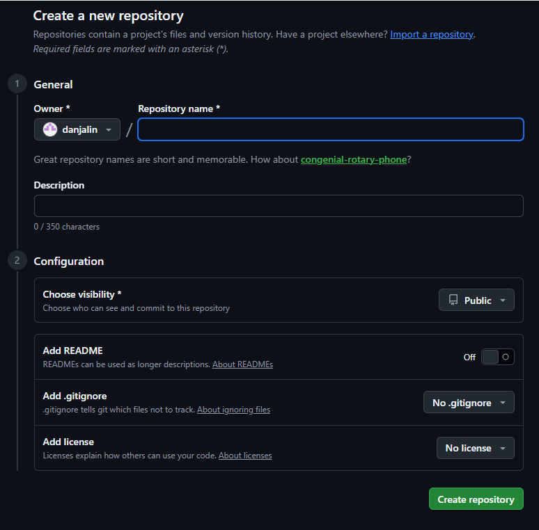
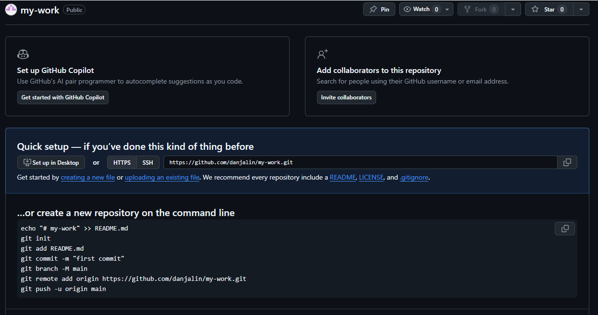
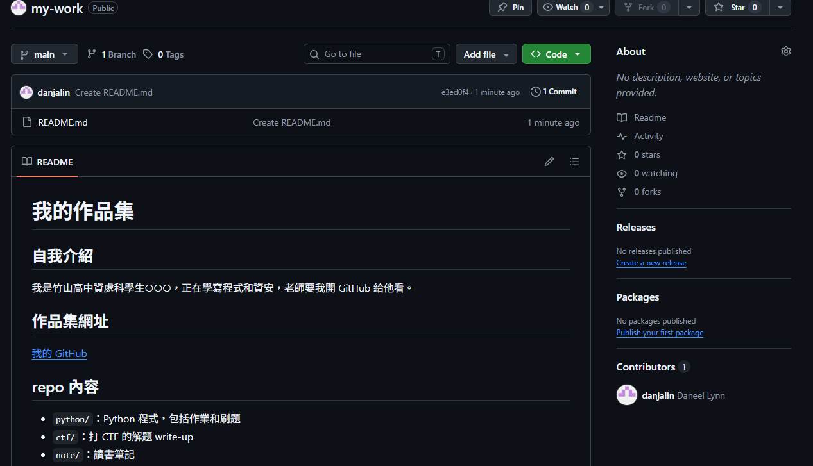
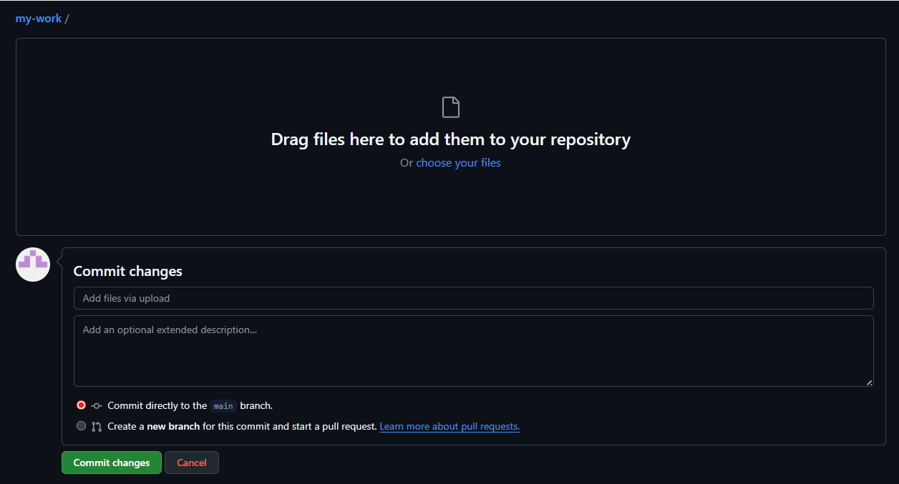
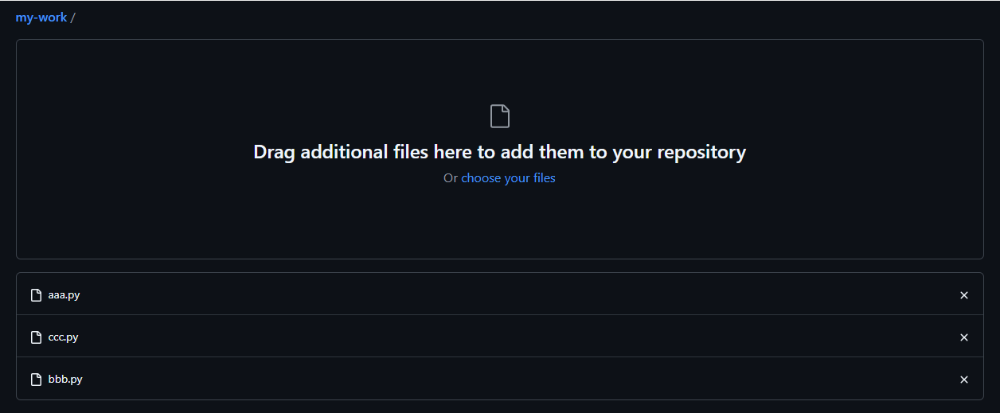
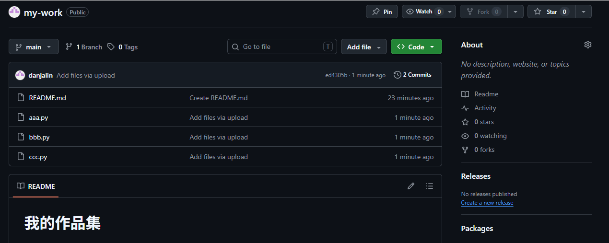
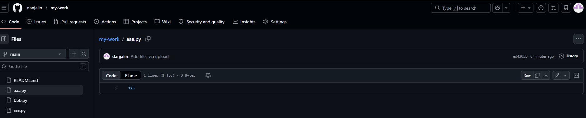
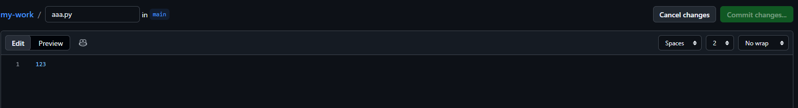

# GitHub 作為資訊學習歷程與作品集平台簡介
版本：v1.0

本文件係介紹竹山高中資料處理科學生如何使用 GitHub 作為學習歷程與作品集平台。這種用法和工程師平常使用 GitHub 的「正常」方式大不相同，但對學生整理作業、作品、自學紀錄與升學資料很有幫助。

## GitHub 是什麼？
- 簡單說，就是一個超大型線上原始程式碼的公開分享平台，具有共同協作與版本控制的功能。工程師通常會使用 Git 軟體和本機端同步控制，不過這部分比較進階，老師不會教你，因為老師自己的東西也還沒複雜到需要用 Git。XDDDDD
- 想看更詳細介紹，可以看 [維基百科](https://zh.wikipedia.org/zh-tw/GitHub)

## 為什麼要用 GitHub？
1. 因為你是資料處理科學生，**資字輩**金字塔最底層。稍微會用的話，可以稍稍往上爬一格。  
  > 補充：這種「資字輩」金字塔到了大學也沒有消失。資管系在技術訓練與外界印象上，通常永遠比資工系低至少一級。不是說資管不能走技術路線，而是你如果想跟資工系的人搶程式、資安、系統、網路等技術導向職位，就要拿出更多證據：GitHub、作品集、競賽、證照、專案紀錄。光說「我也是資訊相關科系」通常不太夠。
2. GitHub 的特性，很適合把你的上課作業，或是私底下幹的好事，整理成一包。隨著你慢慢成長，這包東西也會越腫越大，成為你不可分割的一部分。
3. 存放方式系統化、好整理，但內容可以很隨興奔放。比學校規定的學習歷程檔案系統自由很多；需要轉過去的話，只要找地方把 Markdown 存成 PDF 再上傳就行了。XDDDDD  
 （謎之音：沒人規定 GitHub 不能放 PDF 或其他各式各樣的檔案......）
4. 如果你要升學**資字輩**的科系，尤其是特殊選才、申請或甄選管道，對方可能會要求或鼓勵你提供 GitHub 給他們看作品集、程式碼或學習紀錄。這時候，整理好的 GitHub 往往比單純上傳到學習歷程檔案更有說服力。畢竟用 GitHub 往往代表你開始踏進同一國，至少不再只是站在門外看熱鬧。
5. 所以 GitHub 不只是放作品，也是在練習把技術成果整理成別人看得懂的樣子。就像穿 T 恤短褲躲在機房的工程師，必要時也被逼著套上 polo 衫卡其褲，出來向別人簡報**自己到底做了什麼**。

## 用 GitHub 做什麼？
很簡單的四個任務：
1. 在 GitHub 網頁端開帳號，建立公開儲存庫（repository，簡稱 repo）。
2. 使用資料夾整理檔案。一個資料夾放一個主題，不要什麼都丟在一起。
3. （盡量）每個資料夾都寫 `README.md`，說明這個資料夾裡放什麼、為什麼要放、怎麼看。
4. 重複 2 和 3；資料夾或檔案有變動時，就要修改對應的 `README.md`。  
> [!WARNING]
>如果你只是把檔案丟上 GitHub，卻沒有 `README.md`，那它只是比較高級的亂放雲端硬碟。

## 註冊與登入
1. 連往 <https://github.com>
2. 點選右上角或畫面中間的 `Sign up`
3. 選擇 `Continue with Google` 按鈕，用學校 Google 帳號登入即可。

## 建立第一個儲存庫（repository）
1. 登入後，點選畫面左側 `Create repository` 按鈕後，如下圖：



2. 給你的儲存庫取個稱頭的名字
    - 建議使用英文小寫、數字、`-` 或 `_`
    - 簡單明瞭，不要取成看不懂的亂碼
    - 不知道取什麼，就直接叫 `my-work`
3. Choose visibility 預設 `public`，就不要改了。

> [!NOTE]
> - 這個儲存庫是用來當作品集與學習紀錄，所以先設為 `Public`。
> - 不要把自己或別人的個資放進公開儲存庫。`Public` 的意思就是全世界都看得到，不是只有老師看得到。

4. Description 要不要寫都可以，不勉強。也可以直接拷貝下一行：
    ```txt
    My learning portfolio
    ```
5. 拉到最下方，按右下角 `Create repository` 按鈕，就建好了。

## 建立 README.md
1. 建好的 repo 長這樣，別被英文嚇到。我們準備開始加內容。



2. 如圖，中間有一行 `Get started by...`，然後有 5 個超連結，直接點 `README`，進入 Markdown 編輯畫面。
3. 檔名 `README.md` 不要改，直接在編輯框內貼上下列內容（記得把原來的 `# my-work` 蓋過），反正你以後會寫 Markdown 再自己改。

```md
# 我的作品集

## 自我介紹
我是竹山高中資處科學生○○○，正在學寫程式和資安，這裡用來整理我的作業、作品和學習紀錄。

## 作品集網址
[我的 GitHub](請改成你自己的 GitHub 網址)

## repo 內容
- `python/`：Python 程式，包括作業和刷題
- `ctf/`：打 CTF 的解題 write-up
- `note/`：讀書筆記
```

> [!WARNING]
> - 再強調一次，`README.md` 會公開顯示在 repo 首頁。不要把自己或別人的個資寫進去。

4. 點選右上角 `Commit changes` 按鈕，出現對話框，不用管裡面內容，再按一次 `Commit changes` 完成，repo 頁面就會變成這樣：



## 新增 / 上傳檔案
1. 之後你就可以使用 `Add file` 按鈕來新增 / 上傳檔案。既然是放自己的作品，當然是以上傳為主，以下步驟以上傳教學為例。
2. 點選 `Add file`，選擇 `Upload files` 按下去，進入上傳畫面：



3. 用拖曳或點選方式加入檔案後，會上傳並顯示你所選擇的檔案：



4. 往下拉，按 `Commit changes` 按鈕，檔案就會放在你的 repo 根目錄了。



## 搬移檔案到適當的資料夾
1. 所有檔案塞到根目錄也不是辦法，所以一開始就要養成整理的好習慣。
2. 以下以 `aaa.py` 為例，來說明如何建立資料夾並搬移檔案。
3. 點選 `aaa.py`，會進入一個類似 `檔案總管` 的畫面：



4. 看到右邊 `Edit this file` 按鈕（一枝筆圖示），按下去：



5. 你可以編輯檔案內容，不過我們暫時不管，注意看上面，檔名和路徑可以自己打。
6. 由於 GitHub 沒有空白資料夾，所以我們要建立新資料夾，就得搬一個檔案進去。這邊我們把檔名 `aaa.py` 改成 `python/aaa.py`，剛打完 `/`，系統就會幫我們建立 `python` 資料夾了。
7. 接著按右邊的 `Commit changes` 按鈕，再確認一次就完成搬移。
8. 回到 repo 首頁，確認 `aaa.py` 已經被搬到 `python` 資料夾裡。
9. 其他檔案也可以依樣搬移到適當資料夾。

> [!WARNING]
> - 不要為了分類而亂分類。
> - 一開始可以先用 `python`、`ctf`、`note` 三個資料夾就好。資料夾太多但沒有整理邏輯，只是把一大坨亂變成很多小坨亂。

10. 記得每個資料夾都要寫自己的 `README.md`，說明這個資料夾放什麼、每個檔案是什麼、作業或作品要怎麼看。
11. Markdown 不會寫的話，請參閱 [Markdown 簡介](./markdown_intro.md)
