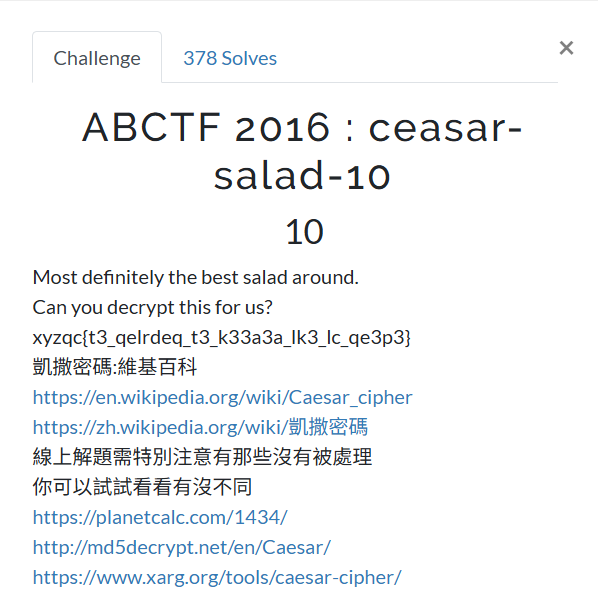

# Crypto101
## ABCTF 2016: ceasar-salad-10

## 題目資訊
- 類型：Crypto  
- 工具：<https://www.dcode.fr/caesar-cipher>
- 方法：凱薩加密法 / Caesar cipher

## 解題思路
1. 由標題 `ceasar-salad` 推測，本題使用 `凱薩加密法` 加密。
2. 正常情況下，要從加密後的 flag 前綴 `xyzqc` 推測它應該對應到 `abctf`，再計算字母位移量。不過本題使用線上工具暴力嘗試所有位移即可快速解出。

## 解題方法
1. 將整組加密後的 flag `xyzqc{t3_qelrdeq_t3_k33a3a_lk3_lc_qe3p3}` 貼到線上工具，按下 `DECRYPT (BRUTEFORCE)` 鍵，所有暴力解的結果會顯示在左側視窗。
2. 工具網站自動會把最有可能的 flag 答案置於最上方，但仍需自行檢查結果是否符合 CTF flag 格式。
3. 因此，本題 flag 是 `XXXXXXXXXXXXXXXXXXXX`
    （**老師示範不會把 flag 寫出來，但同學寫 write-up 的時候就需要**）

## 學習重點
- 從題目標題或提示推測可能的加密法。
- Caesar cipher 是單表位移加密，可用暴力法嘗試 25 種位移。
- 解出結果後，要檢查是否符合 flag 格式。
- 工具可以加速解題，但仍需理解工具做了什麼。
