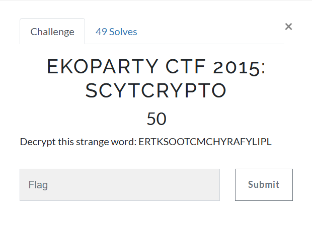

# Crypto101
## EKOPARTY CTF 2015: SCYTCRYPTO

## 題目資訊
- 類型：Crypto  
- 工具：<https://www.dcode.fr/scytale-cipher>
- 方法：密碼棒加密法 / scytale cipher

## 解題思路
1. 本題從標題 `SCYTCRYPTO` 可知採用 `密碼棒加密法`。
2. 密碼棒加密法理論上要再透過提示得知 `密碼棒的寬度`，但由於本題密文很短，就老實不客氣地使用線上工具暴力嘗試所有可能，即可快速解出。

## 解題方法
1. 將整組密文貼到線上工具，按下 `DECRYPT (BRUTEFORCE)` 鍵，所有暴力解的結果會顯示在左側視窗。
2. 工具網站自動會把最有可能的明文（含 flag 答案）置於最上方，但仍需自行檢查結果是否符合英文格式。
3. 由於本題出題單位是 `EKOPARTY`，可推測 flag 前綴可能是 `EKO`，再將其餘部分以 `{` 與 `}` 組成符合格式的 flag。
4. 因此，本題 flag 是 `XXXXXXXXXXXXXXXXXXXX`
    （**老師示範不會把 flag 寫出來，但同學寫 write-up 的時候就需要**）

## 學習重點
- 從題目標題或提示推測可能的加密法。
    - 例：看到 `SCYT`、`scytale`，想到 `密碼棒加密法`
- **判定為「密碼棒加密法」後，先確認是否有提示密碼棒寬度**；若密文很短，也可用工具暴力嘗試破解。
- 解出結果後，要檢查是否符合英文明文或 flag 格式。
- 工具可以加速解題，但仍需理解工具做了什麼。
