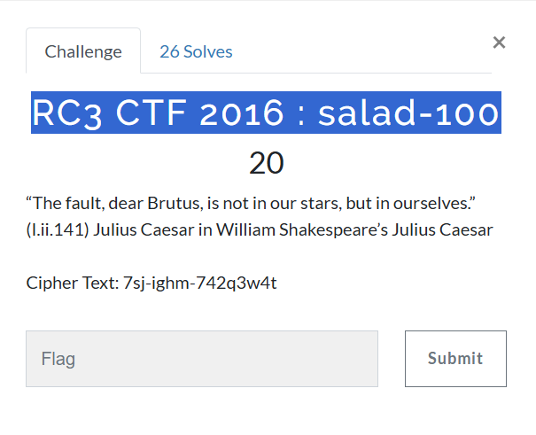

# Crypto101
## RC3 CTF 2016: salad-100

## 題目資訊
- 類型：Crypto  
- 工具：<https://www.dcode.fr/caesar-cipher>
- 方法：凱薩加密法 / Caesar cipher

## 解題思路
1. 本題從標題 `salad` 和題目內文 `Julius Caesar`，可知採用 `凱薩加密法`。
2. 由於出題單位是 RC3 CTF 2016，可推測 flag 前綴為 `rc3-2016`，比對密文 `7sj-ighm`，可知本題使用的凱薩加密法不只英文字母，還包括 `0~9`。

## 解題方法
1. 將整組密文貼到線上工具的 `CAESAR SHIFTED CIPHERTEXT` 輸入框。
2. 由於工具的暴力解只適用於**純英文字母**，所以要使用下方的人工解密（MANUAL DECRYPTION AND PARAMETERS）。
3. 點選 `USE A CUSTOM ALPHABET (A-Z0-9 CHARS ONLY)` 選項，輸入框預設值已經把 `0123456789` 排在 `A-Z` 之前，先不用改。
4. 看到上面的 `SHIFT/KEY (NUMBER):` 輸入框，預設值為 `3`，從 `1` 開始逐一遞增測試。記得按下方 `DECRYPT` 按鈕，而非上方的 `DECRYPT (BRUTEFORCE)` 按鈕。
5. 解碼結果會顯示在左側視窗，檢查是否符合英文明文或 flag 格式。不符合則把 `SHIFT/KEY` 加 1 繼續測試。
6. 測到 `SHIFT/KEY` 為 `XX` 的時候，結果總算像正常英文了。但工具網站居然會自動首字大寫，所以記得改回小寫。
7. 因此，本題 flag 是 `XXXXXXXXXXXXXXXXXXXX`。因才網的解說影片介紹如何人工破解，值得照著練習一遍，體會古代人的辛勞。
    （**老師示範不會把 flag 寫出來，但同學寫 write-up 的時候就需要**）

## 學習重點
- 從題目標題或提示推測可能的加密法。
    - 例：看到 `salad` 或 `Caesar`，想到 `凱薩加密法`
- **判定為「凱薩加密法」後，先確認字母表範圍。** 除了傳統的 `A-Z`，有些題目會加入 `0-9`；這時還要注意數字放在 `A-Z` 之前或之後。
- 解出結果後，要檢查是否符合英文明文或 flag 格式。
- 工具可以加速解題，但仍需理解工具做了什麼。如果嫌工具還要按很多次很煩，可以嘗試人工手動解碼。
