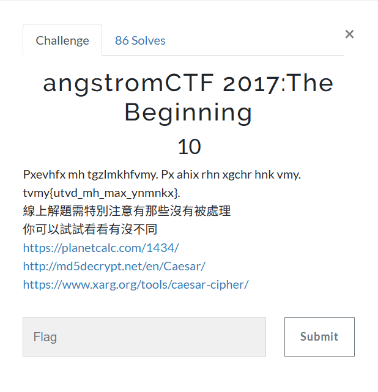

# Crypto 101
## angstromCTF 2017: The Beginning

## 題目資訊
- 類型：Crypto  
- 工具：<https://www.dcode.fr/caesar-cipher>
- 方法：凱薩加密法 / Caesar cipher

## 解題思路
1. 本題就截圖來看，只有密文，似乎無從下手。
2. 但如果參考因才網本題解析，可以看到本題其實有個提示：`I sure like my salad...`，由此推測，本題使用 `凱薩加密法` 加密。
3. 既然推測是 `凱薩加密法`，就老實不客氣地使用線上工具暴力嘗試所有位移，即可快速解出。

## 解題方法
1. 將整組密文貼到線上工具，按下 `DECRYPT (BRUTEFORCE)` 鍵，所有暴力解的結果會顯示在左側視窗。
2. 工具網站自動會把最有可能的明文（含 flag 答案）置於最上方，但仍需自行檢查結果是否符合英文格式。
3. 因此，本題 flag 是 `XXXXXXXXXXXXXXXXXXXX`
    （**老師示範不會把 flag 寫出來，但同學寫 write-up 的時候就需要**）

## 學習重點
- 從題目標題或提示推測可能的加密法。
    - 例：看到 `salad`，想到 `凱薩`
- **一旦判定為 Caesar cipher，就可使用工具，暴力嘗試 25 種位移。**
- 解出結果後，要檢查是否符合英文明文或 flag 格式。
- 工具可以加速解題，但仍需理解工具做了什麼。
