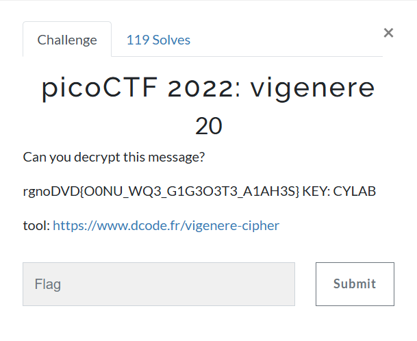

# Crypto101
## picoCTF 2022: vigenere

## 題目資訊
- 類型：Crypto  
- 工具：<https://www.dcode.fr/vigenere-cipher>
- 方法：維吉尼亞加密法 / Vigenère cipher

## 解題思路
1. 本題從標題 `vigenere` 可知採用 `維吉尼亞加密法`。
2. 維吉尼亞加密法要再得知金鑰（key）的內容，但本題已經很大方地提供了。

## 解題方法
1. 將整組密文貼到線上工具的 `VIGENERE CIPHERTEXT` 輸入框。
2. 在 `KNOWING THE KEY/PASSWORD:` 後面的文字框中輸入金鑰 `CYLAB`。
3. 按下下方的 `DECRYPT` 鍵（不是上方的 `AUTOMATIC DECRYPTION` 鍵），結果就顯示在左側視窗。
4. 因此，本題 flag 是 `XXXXXXXXXXXXXXXXXXXX`
    （**老師示範不會把 flag 寫出來，但同學寫 write-up 的時候就需要**）

## 學習重點
- 從題目標題或提示推測可能的加密法。
    - 例：看到 `vigenere`，想到 `維吉尼亞加密法`
- **判定為「維吉尼亞加密法」後，先確認是否取得 key**。入門題通常會把 key 藏在題目、提示、附件、檔案資訊或其他解題步驟中；若沒有 key，才考慮使用自動分析或其他破解方法。
- 解出結果後，要檢查是否符合英文明文或 flag 格式。
- 工具可以加速解題，但仍需理解工具做了什麼。
